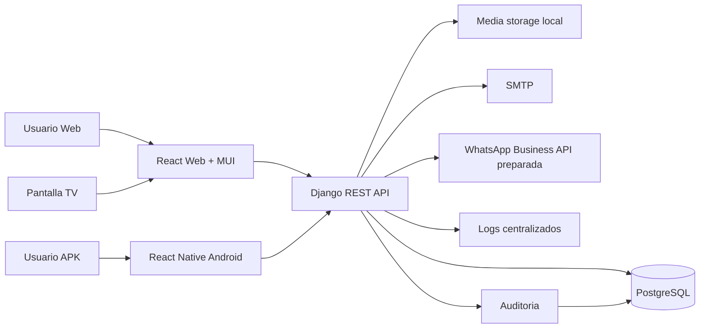

# 01 - Analisis funcional y arquitectura

## 1. Lectura de referencias

### Taller.zip

El proyecto de referencia es una app Next.js orientada a taller de chapa y pintura. Cubre los flujos principales de negocio:

- Login y roles simples: propietario y empleado.
- Clientes, vehiculos, turnos/citas, ordenes de trabajo.
- Estados de orden, historial de estado, daños, piezas, pinturas/materiales.
- Facturacion, pagos y dashboard operativo.
- Navegacion lateral, busqueda, formularios CRUD y cards de indicadores.

Puntos a conservar funcionalmente:

- Flujo cliente -> vehiculo -> turno -> orden -> tareas/insumos -> presupuesto/factura.
- Estado visual de ordenes, vencimientos, piezas pendientes y facturacion.
- Historial completo para ordenes y vehiculos.
- UX rapida para alta y consulta.

Puntos a reemplazar por requerimiento:

- Supabase Auth/RLS se reemplaza por Django, Django REST Framework, Simple JWT y permisos de aplicacion.
- Next.js se reemplaza por React con React Router.
- Datos directos desde frontend se reemplazan por API REST versionada.
- El modelo se amplia para recursos tecnologicos, asignaciones, reparaciones, auditoria, dashboard TV y APK.

### Template.zip

El template es Material Dashboard React, basado en Material UI. Se toma como guia de formato:

- Fuente: Roboto, Helvetica, Arial.
- Paleta base: fondo `#f0f2f5`, texto `#7b809a`, dark `#344767`, info `#1A73E8`, success `#4CAF50`, warning `#fb8c00`, error `#F44335`.
- Login con imagen de fondo y card centrada.
- Sidebar persistente con iconos Material.
- Cards de indicadores con icono destacado y conteo.
- Tablas con busqueda, paginacion y ordenamiento.
- Graficos con Chart.js o equivalente.

Decision importante: no copiar el template completo como framework interno. Se recrea una UI propia con Material UI respetando su lenguaje visual, porque el sistema final debe ser enterprise, mantenible y libre de dependencias visuales innecesarias.

## 2. Objetivo funcional consolidado

AutoFlow debe administrar dos dominios conectados:

1. Taller automotor:
   - Clientes, vehiculos, turnos, comunicaciones, ordenes, tareas, daños, repuestos, materiales, presupuestos, facturas, pagos y dashboards.

2. Recursos tecnologicos:
   - Celulares, lineas, PCs/notebooks, choferes, empleados, asignaciones, reparaciones, historial e indicadores.

Ambos dominios comparten:

- Usuarios, roles y permisos.
- Auditoria.
- Baja logica.
- Archivos/fotos.
- Busqueda, filtros, paginacion e indicadores.
- API REST consumida por web y APK.

## 3. Arquitectura propuesta

## 4. Stack decidido

### Backend

- Django.
- Django REST Framework.
- Simple JWT para access/refresh tokens.
- PostgreSQL.
- `django-filter` para filtros.
- `drf-spectacular` para OpenAPI/Swagger.
- Manejo centralizado de errores con exception handler custom.
- Auditoria mediante middleware + mixins en serializers/viewsets.
- Baja logica por modelo base.
- Logs estructurados a consola y archivo.

### Frontend web

- React.
- React Router.
- Axios con interceptores JWT y refresh.
- Redux Toolkit para sesion, perfil y permisos.
- React Query para server-state, cache y reintentos.
- Material UI como sistema visual.
- MUI Icons para iconografia.
- Chart.js o Recharts para indicadores.

Motivo: Redux Toolkit queda reservado para estado global real de app; React Query evita duplicar cache de entidades y simplifica loading/error/paginacion.

### Mobile APK

- React Native.
- API REST Django.
- JWT.
- Camara con permisos Android.
- OCR preparado con Google ML Kit, con interfaz reemplazable para OpenCV u OCR externo.
- Almacenamiento seguro de tokens.

Motivo: React Native permite reutilizar criterio de validaciones, contratos de API, naming y parte del equipo mental de React.

### Infraestructura monolitica

- Todo desplegado en `C:\AutoFlow`.
- PostgreSQL local.
- Django API local como servicio.
- React compilado servido desde la misma PC.
- Nginx o servidor HTTP local como reverse proxy recomendado.
- Variables de entorno por componente.
- Logs en `C:\AutoFlow\logs`.

## 5. Modulos backend

Apps Django propuestas:

- `accounts`: usuarios, roles, permisos, sesiones.
- `core`: modelos base, soft delete, utilidades, errores, paginacion.
- `clients`: clientes.
- `vehicles`: vehiculos e historial.
- `appointments`: turnos y comunicaciones.
- `work_orders`: ordenes, tareas, daños, estados.
- `inventory`: repuestos, materiales, movimientos de stock.
- `billing`: presupuestos, facturas, pagos.
- `assets`: celulares, lineas, PCs/notebooks, marcas/modelos.
- `people`: choferes, empleados, personas asignables.
- `assignments`: asignaciones activas e historicas.
- `repairs`: reparaciones de equipos.
- `dashboard`: indicadores operativos y dashboard TV.
- `mobile`: endpoints especificos de APK/OCR.
- `audit`: auditoria funcional y de sesiones.

## 6. Principios de diseno

- API first: web y APK consumen los mismos endpoints.
- Modulos desacoplados, pero una sola base PostgreSQL.
- Historial antes que sobrescritura destructiva.
- Baja logica en registros criticos.
- Validaciones duplicadas donde corresponde: frontend para UX, backend como fuente de verdad.
- Indices pensados desde el inicio para dashboard, busqueda por patente, recursos activos e historial.
- Endpoints versionados bajo `/api/v1/`.
- Dashboard TV con payload especifico, no armado por multiples llamadas del frontend.

## 7. Seguridad

- Password hashing nativo Django.
- JWT access corto y refresh rotativo.
- Control de permisos por rol y por accion.
- Bloqueo de eliminacion fisica para registros criticos.
- Auditoria de login, logout, refresh, cambios de estado, asignaciones y reparaciones.
- Variables sensibles fuera del repositorio.
- HTTPS obligatorio en produccion.
- CORS restringido a origenes configurados.

## 8. Riesgos y mitigaciones

| Riesgo | Impacto | Mitigacion |
|---|---:|---|
| Alcance muy amplio para una primera version | Alto | Implementar por etapas con MVP funcional y contratos estables |
| OCR de patentes con baja precision | Medio | Correccion manual obligatoria y almacenamiento de confianza OCR |
| WhatsApp Business API depende de proveedor/configuracion | Medio | Preparar interfaz y registrar comunicaciones aunque el canal quede en modo mock/configurable |
| Dashboard TV puede generar carga si consulta muchas tablas | Medio | Endpoint agregado, indices y cache corta |
| Asignaciones simultaneas inconsistentes | Alto | Constraints parciales en PostgreSQL y transacciones |
| Auditoria excesiva puede crecer rapido | Medio | Indices, retencion configurable y paginacion |
| Template visual con licencia externa | Bajo/Medio | Usarlo como guia visual; no copiar assets/componentes sin validar licencia |

## 9. Validacion de arquitectura antes de codigo

Antes de pasar a la etapa backend se recomienda validar:

- Si "Usuario App" tendra permisos por modulo o solo rol general.
- Formato exacto de patente/chapa esperado por pais/region.
- Si las fotos de daños y OCR se guardaran en disco local o storage externo futuro.
- Si facturacion requiere numeracion fiscal real o solo comprobante interno.
- Proveedor de WhatsApp Business API.
- Direccion, contacto y horarios reales del taller para comunicaciones.

## 10. Propuesta de MVP por alcance

Primera version productiva sugerida:

- Auth JWT, usuarios y roles.
- Clientes, vehiculos, turnos y comunicaciones por email.
- Ordenes, tareas, daños con fotos.
- Repuestos/materiales basicos y stock critico.
- Dashboard operativo y dashboard TV.
- APK con login, lectura/carga manual de patente, consulta de estado y creacion de turno.
- Auditoria base.

Segunda version:

- Recursos tecnologicos completos, asignaciones, reparaciones e indicadores avanzados.
- WhatsApp Business API real.
- Presupuestos/facturacion ampliada.
- Reportes historicos avanzados.
