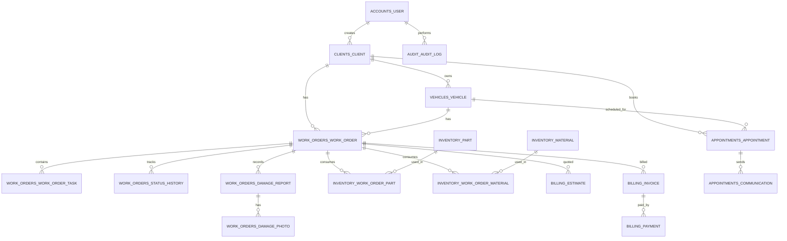
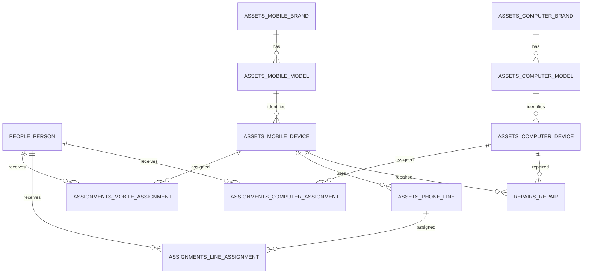

# 02 - Modelo de datos, relaciones, indices y reglas

## 1. Convenciones generales

- Base de datos: PostgreSQL.
- PK: UUID en tablas de negocio.
- Fechas: `created_at`, `updated_at`, `deleted_at`.
- Auditoria minima por registro: `created_by_id`, `updated_by_id`.
- Baja logica: `deleted_at IS NULL` indica registro vigente.
- Estados: usar `TextChoices` en Django y constraints/validaciones de aplicacion.
- Patentes: guardar `plate` visible y `plate_normalized` para busqueda/unicidad.
- Archivos/fotos: guardar metadatos en DB y archivo en storage local configurable.

## 2. ER principal



## 3. ER recursos tecnologicos



## 4. Tablas propuestas

### accounts_user

Usuario custom de Django.

Campos:

- `id`
- `email` unico
- `first_name`
- `last_name`
- `role`: `admin`, `app_user`
- `phone`
- `is_active`
- `is_staff`
- `last_login`
- `password`
- `created_at`
- `updated_at`
- `deleted_at`

Reglas:

- Administrador tiene acceso total.
- Usuario App no elimina registros criticos.
- Permisos finos pueden modelarse con grupos/permisos nativos de Django.

### audit_session_audit

Campos:

- `id`
- `user_id`
- `event`: `login`, `logout`, `refresh`, `failed_login`
- `ip_address`
- `user_agent`
- `session_key`
- `created_at`
- `metadata`

### audit_audit_log

Campos:

- `id`
- `user_id`
- `module`
- `action`: `create`, `update`, `delete`, `restore`, `status_change`, `login`, `logout`, `send_notification`
- `object_type`
- `object_id`
- `old_data` JSONB
- `new_data` JSONB
- `ip_address`
- `session_key`
- `created_at`

Indices:

- `(module, created_at)`
- `(object_type, object_id)`
- `(user_id, created_at)`

### clients_client

Campos:

- `id`
- `first_name`
- `last_name`
- `document`
- `phone`
- `email`
- `address`
- `city`
- `notes`
- `status`: `active`, `inactive`
- auditoria y baja logica

Indices:

- `document`
- `email`
- `last_name`
- busqueda trigram opcional sobre nombre/apellido/documento.

### vehicles_vehicle

Campos:

- `id`
- `client_id`
- `brand`
- `model`
- `plate`
- `plate_normalized`
- `year`
- `color`
- `vin`
- `notes`
- `status`: `active`, `inactive`
- auditoria y baja logica

Reglas:

- `plate_normalized` unico cuando `deleted_at IS NULL`.
- No duplicar patente.
- Mantener historial por ordenes, cambios y auditoria.

Indices:

- `client_id`
- `plate_normalized` unico parcial.
- `vin`
- `(status, deleted_at)`

### appointments_appointment

Campos:

- `id`
- `client_id`
- `vehicle_id`
- `scheduled_date`
- `scheduled_time`
- `scheduled_at`
- `status`: `scheduled`, `confirmed`, `cancelled`, `completed`
- `notes`
- `created_by_id`
- auditoria y baja logica

Reglas:

- Validar disponibilidad por fecha/hora.
- Evitar duplicados activos para mismo vehiculo, fecha y hora.
- Si cambia fecha/hora, habilitar reenvio de notificacion.

Indices:

- `(scheduled_at, status)`
- `(client_id, scheduled_at)`
- `(vehicle_id, scheduled_at)`

### appointments_communication

Campos:

- `id`
- `appointment_id`
- `channel`: `email`, `whatsapp`
- `recipient`
- `message`
- `status`: `pending`, `sent`, `failed`
- `sent_at`
- `error_message`
- `created_by_id`
- `created_at`

Indices:

- `(appointment_id, created_at)`
- `(channel, status, created_at)`

### work_orders_work_order

Campos:

- `id`
- `order_number` unico
- `client_id`
- `vehicle_id`
- `entry_date`
- `estimated_delivery_date`
- `actual_delivery_date`
- `priority`: `low`, `normal`, `high`, `urgent`
- `description`
- `notes`
- `status`: `scheduled`, `received`, `estimating`, `approved`, `waiting_parts`, `in_repair`, `in_paint`, `finished`, `delivered`, `cancelled`
- `progress_percent` calculado o cacheado
- auditoria y baja logica

Reglas:

- No permitir mas de una orden activa por vehiculo salvo permiso admin.
- Avance = tareas completadas / tareas totales.
- Cambios de estado generan historial y auditoria.

Indices:

- `order_number`
- `(status, priority)`
- `(vehicle_id, status)`
- `(estimated_delivery_date, status)`
- parcial para orden activa por vehiculo:
  - `(vehicle_id) WHERE status NOT IN ('delivered','cancelled') AND deleted_at IS NULL`

### work_orders_work_order_task

Campos:

- `id`
- `work_order_id`
- `title`
- `description`
- `status`: `pending`, `in_progress`, `completed`, `cancelled`
- `priority`
- `responsible_id`
- `sector`
- `execution_order`
- `estimated_date`
- `started_at`
- `finished_at`
- `notes`
- auditoria y baja logica

Reglas:

- Una orden puede tener muchas tareas.
- Al completar/cancelar tarea, recalcular avance.
- Dashboard TV consulta tareas pendientes por orden.

Indices:

- `(work_order_id, execution_order)`
- `(status, sector)`
- `(responsible_id, status)`

### work_orders_status_history

Campos:

- `id`
- `work_order_id`
- `old_status`
- `new_status`
- `changed_by_id`
- `notes`
- `created_at`

### work_orders_damage_report

Campos:

- `id`
- `work_order_id`
- `damage_type`
- `severity`: `minor`, `moderate`, `severe`
- `description`
- `notes`
- `created_by_id`
- `created_at`
- `deleted_at`

### work_orders_damage_photo

Campos:

- `id`
- `damage_report_id`
- `image`
- `thumbnail`
- `created_at`

### inventory_part

Campos:

- `id`
- `code` unico
- `name`
- `description`
- `stock`
- `min_stock`
- `cost`
- `status`: `active`, `inactive`
- auditoria y baja logica

Indices:

- `code`
- `(stock, min_stock)`

### inventory_material

Campos:

- `id`
- `code` unico
- `name`
- `type`
- `stock`
- `min_stock`
- `cost`
- `status`
- auditoria y baja logica

### inventory_work_order_part

Campos:

- `id`
- `work_order_id`
- `part_id`
- `quantity`
- `unit_cost`
- `total_cost`
- `status`: `reserved`, `used`, `returned`
- `created_at`

Reglas:

- No consumir mas stock que disponible.
- Registrar movimiento de stock.

### inventory_work_order_material

Campos equivalentes a repuestos, apuntando a `inventory_material`.

### inventory_stock_movement

Campos:

- `id`
- `item_type`: `part`, `material`
- `part_id` nullable
- `material_id` nullable
- `movement_type`: `in`, `out`, `adjustment`, `return`
- `quantity`
- `reason`
- `work_order_id`
- `created_by_id`
- `created_at`

### billing_estimate

Campos:

- `id`
- `work_order_id`
- `labor_amount`
- `materials_amount`
- `parts_amount`
- `total_amount`
- `status`: `pending`, `approved`, `rejected`
- `approved_at`
- `created_at`
- auditoria

### billing_invoice

Campos:

- `id`
- `work_order_id`
- `invoice_number`
- `issued_at`
- `total`
- `payment_status`: `pending`, `partial`, `paid`, `cancelled`
- `notes`
- auditoria y baja logica

### billing_payment

Campos:

- `id`
- `invoice_id`
- `amount`
- `method`: `cash`, `transfer`, `card`, `other`
- `paid_at`
- `reference`
- `notes`
- `created_by_id`

### assets_mobile_brand

Campos:

- `id`
- `name` unico
- `status`

### assets_mobile_model

Campos:

- `id`
- `brand_id`
- `model`
- `storage`
- `ram`
- `operating_system`
- `notes`
- `status`

### assets_mobile_device

Campos:

- `id`
- `brand_id`
- `model_id`
- `imei` unico
- `serial_number`
- `purchase_date`
- `status`: `available`, `assigned`, `in_repair`, `broken`, `retired`
- `notes`
- auditoria y baja logica

### assets_phone_line

Campos:

- `id`
- `number` unico
- `provider`
- `plan`
- `status`: `available`, `assigned`, `suspended`, `retired`
- `mobile_device_id` nullable
- `notes`
- auditoria y baja logica

### assets_computer_brand

Campos:

- `id`
- `name` unico
- `status`

### assets_computer_model

Campos:

- `id`
- `equipment_type`: `pc`, `notebook`, `tablet`
- `brand_id`
- `model`
- `processor`
- `ram`
- `disk`
- `operating_system`
- `notes`
- `status`

### assets_computer_device

Campos:

- `id`
- `equipment_type`: `pc`, `notebook`, `tablet`
- `brand_id`
- `model_id`
- `serial_number` unico
- `inventory_code` unico
- `processor`
- `ram`
- `disk`
- `operating_system`
- `status`: `available`, `assigned`, `in_repair`, `broken`, `retired`
- `notes`
- auditoria y baja logica

### people_person

Tabla unificada para choferes y empleados internos.

Campos:

- `id`
- `person_type`: `driver`, `employee`
- `first_name`
- `last_name`
- `dni`
- `employee_number` o `file_number`
- `phone`
- `email`
- `sector`
- `position`
- `status`: `active`, `inactive`
- auditoria y baja logica

Reglas:

- Para chofer: `dni`, `file_number`, telefono.
- Para empleado: email, sector, cargo.
- Se evita duplicar tablas de personas y simplifica asignaciones.

### assignments_mobile_assignment

Campos:

- `id`
- `mobile_device_id`
- `person_id`
- `started_at`
- `ended_at`
- `notes`
- `assigned_by_id`
- auditoria

Reglas:

- Un celular no puede tener mas de una asignacion activa.
- Al reasignar se cierra la asignacion activa anterior.
- Cambia estado del celular a `assigned` o `available`.

Indice:

- unico parcial `(mobile_device_id) WHERE ended_at IS NULL`
- `(person_id, started_at)`

### assignments_line_assignment

Igual a celular, apuntando a `assets_phone_line`.

### assignments_computer_assignment

Igual a celular, apuntando a `assets_computer_device`.

### repairs_repair

Campos:

- `id`
- `asset_type`: `mobile`, `computer`, `tablet`
- `mobile_device_id` nullable
- `computer_device_id` nullable
- `person_id`
- `entry_date`
- `exit_date`
- `reason`
- `diagnosis`
- `provider_or_technician`
- `cost`
- `status`: `pending`, `in_repair`, `repaired`, `not_repairable`, `retired`
- `notes`
- auditoria y baja logica

Reglas:

- Debe existir exactamente un recurso asociado segun `asset_type`.
- Al abrir reparacion, recurso pasa a `in_repair`.
- Al cerrar reparacion, recurso pasa a `available`, `assigned`, `broken` o `retired` segun resultado.
- Mantener historial completo.

Indices:

- `(asset_type, status)`
- `(entry_date, status)`
- `(person_id, entry_date)`

### mobile_plate_recognition

Campos:

- `id`
- `image`
- `plate_detected`
- `plate_normalized`
- `confidence`
- `provider`: `manual`, `mlkit`, `opencv`, `external`
- `raw_response` JSONB
- `created_by_id`
- `created_at`

Reglas:

- Si confianza es baja, requerir correccion manual.
- Alta de vehiculo siempre valida duplicado en backend.

## 5. Indices principales

SQL conceptual:

```sql
CREATE UNIQUE INDEX uq_vehicle_plate_active
ON vehicles_vehicle (plate_normalized)
WHERE deleted_at IS NULL;

CREATE INDEX ix_work_order_status_priority
ON work_orders_work_order (status, priority);

CREATE INDEX ix_work_order_delivery
ON work_orders_work_order (estimated_delivery_date, status);

CREATE UNIQUE INDEX uq_active_work_order_vehicle
ON work_orders_work_order (vehicle_id)
WHERE status NOT IN ('delivered', 'cancelled') AND deleted_at IS NULL;

CREATE UNIQUE INDEX uq_active_mobile_assignment
ON assignments_mobile_assignment (mobile_device_id)
WHERE ended_at IS NULL;

CREATE UNIQUE INDEX uq_active_line_assignment
ON assignments_line_assignment (phone_line_id)
WHERE ended_at IS NULL;

CREATE UNIQUE INDEX uq_active_computer_assignment
ON assignments_computer_assignment (computer_device_id)
WHERE ended_at IS NULL;

CREATE INDEX ix_audit_object
ON audit_audit_log (object_type, object_id);
```

## 6. Reglas de negocio transversales

1. Baja logica:
   - No borrar fisicamente clientes, vehiculos, ordenes, asignaciones, reparaciones, facturas ni auditoria.

2. Patentes:
   - Normalizar mayusculas, espacios y guiones.
   - Unicidad por `plate_normalized`.

3. Ordenes:
   - Estados avanzan por flujo permitido.
   - Cambios de estado registran `work_orders_status_history`.
   - Avance se calcula con tareas.

4. Turnos:
   - Cancelar no borra.
   - Reprogramar conserva historial y puede reenviar comunicaciones.

5. Comunicaciones:
   - Todo envio genera registro con estado, fecha, error y usuario.

6. Stock:
   - Consumo de repuestos/materiales genera movimiento.
   - Dashboard marca stock critico si `stock <= min_stock`.

7. Asignaciones:
   - Cualquier reasignacion cierra la activa anterior dentro de una transaccion.
   - Historial nunca se sobreescribe.

8. Reparaciones:
   - Cambian estado del recurso automaticamente.
   - Alimentan indicadores por mes, anio, ranking y roturas por persona/recurso.

9. Auditoria:
   - Toda creacion, edicion, baja logica, cambio de estado, login/logout y envio de notificacion se registra.

10. Dashboard TV:
   - Solo ordenes activas.
   - Maximo 10 ordenes.
   - Prioridad: `in_repair`, `in_paint`, `waiting_parts`, `approved`, `received`.
