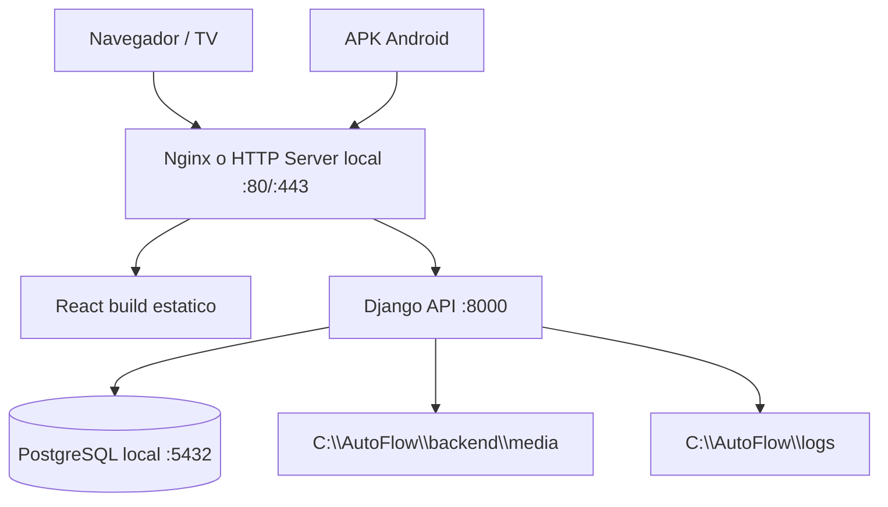

# 05 - Instalacion paso a paso en ambiente monolitico

## 1. Objetivo

Instalar AutoFlow en una sola PC, donde conviven:

- Frontend web React.
- Backend Django REST Framework.
- Base de datos PostgreSQL.
- Archivos/media.
- Logs.
- APK Android consumiendo la API de esa misma PC por red local o HTTPS.

Directorio obligatorio:

```powershell
C:\AutoFlow
```

## 2. Arquitectura de despliegue local



Alternativa simplificada para etapa de desarrollo:

- React dev server en `http://localhost:5173`.
- Django en `http://localhost:8000`.
- PostgreSQL local.

Para produccion monolitica se recomienda:

- React compilado.
- Django servido con Waitress en Windows o Gunicorn en Linux.
- Nginx como reverse proxy.
- Servicios configurados para iniciar con Windows.

## 3. Prerrequisitos

Instalar en la PC:

- Python compatible con la version Django elegida.
- Node.js LTS compatible con React.
- PostgreSQL.
- Git.
- Nginx para Windows o servidor HTTP equivalente.
- NSSM o Windows Services para ejecutar Django como servicio.
- Android Studio y JDK si se va a compilar APK en esa PC.

Crear carpetas:

```powershell
New-Item -ItemType Directory -Force -Path C:\AutoFlow
New-Item -ItemType Directory -Force -Path C:\AutoFlow\logs
New-Item -ItemType Directory -Force -Path C:\AutoFlow\backups
New-Item -ItemType Directory -Force -Path C:\AutoFlow\deploy
```

## 4. Estructura esperada

Cuando el codigo este generado, la carpeta quedara asi:

```text
C:\AutoFlow
  backend\
  frontend\
  mobile\
  docs\
  logs\
  backups\
  deploy\
```

## 5. Crear base PostgreSQL

Abrir SQL Shell o pgAdmin y ejecutar:

```sql
CREATE USER autoflow_user WITH PASSWORD 'cambiar_esta_password';
CREATE DATABASE autoflow_db OWNER autoflow_user;
ALTER ROLE autoflow_user SET client_encoding TO 'utf8';
ALTER ROLE autoflow_user SET default_transaction_isolation TO 'read committed';
ALTER ROLE autoflow_user SET timezone TO 'America/Argentina/Buenos_Aires';
```

Validar conexion:

```powershell
psql -h localhost -U autoflow_user -d autoflow_db
```

## 6. Configurar backend Django

Entrar al backend:

```powershell
cd C:\AutoFlow\backend
python -m venv .venv
.\.venv\Scripts\Activate.ps1
python -m pip install --upgrade pip
pip install -r requirements.txt
```

Crear archivo:

```powershell
C:\AutoFlow\backend\.env
```

Variables sugeridas:

```env
DJANGO_ENV=production
DJANGO_SECRET_KEY=generar_clave_larga
DJANGO_DEBUG=false
DJANGO_ALLOWED_HOSTS=localhost,127.0.0.1,IP_DE_LA_PC
DJANGO_CORS_ALLOWED_ORIGINS=http://localhost,http://127.0.0.1,http://IP_DE_LA_PC

DB_NAME=autoflow_db
DB_USER=autoflow_user
DB_PASSWORD=cambiar_esta_password
DB_HOST=localhost
DB_PORT=5432

JWT_ACCESS_MINUTES=15
JWT_REFRESH_DAYS=7

EMAIL_HOST=smtp.servidor.com
EMAIL_PORT=587
EMAIL_HOST_USER=usuario
EMAIL_HOST_PASSWORD=password
EMAIL_USE_TLS=true
DEFAULT_FROM_EMAIL=taller@empresa.com

WORKSHOP_NAME=AutoFlow Taller
WORKSHOP_ADDRESS=Direccion del taller
WORKSHOP_CONTACT=Telefono o WhatsApp

WHATSAPP_PROVIDER=disabled
WHATSAPP_API_URL=
WHATSAPP_TOKEN=

MEDIA_ROOT=C:\AutoFlow\backend\media
STATIC_ROOT=C:\AutoFlow\backend\staticfiles
LOG_DIR=C:\AutoFlow\logs
```

Aplicar migraciones:

```powershell
python manage.py migrate
python manage.py collectstatic --noinput
python manage.py createsuperuser
```

Validar:

```powershell
python manage.py runserver 0.0.0.0:8000
```

Abrir:

```text
http://localhost:8000/api/health/
http://localhost:8000/api/docs/
```

## 7. Ejecutar backend como servicio Windows

Opcion recomendada en Windows: Waitress + NSSM.

Instalar Waitress si no esta en requirements:

```powershell
cd C:\AutoFlow\backend
.\.venv\Scripts\Activate.ps1
pip install waitress
```

Comando del servicio:

```powershell
C:\AutoFlow\backend\.venv\Scripts\waitress-serve.exe --listen=127.0.0.1:8000 config.wsgi:application
```

Crear servicio con NSSM:

```powershell
nssm install AutoFlowBackend
```

Configurar:

- Application path: `C:\AutoFlow\backend\.venv\Scripts\waitress-serve.exe`
- Startup directory: `C:\AutoFlow\backend`
- Arguments: `--listen=127.0.0.1:8000 config.wsgi:application`
- Environment: cargar variables desde `.env` segun implementacion o configurar en servicio.
- Logs stdout: `C:\AutoFlow\logs\backend.out.log`
- Logs stderr: `C:\AutoFlow\logs\backend.err.log`

Iniciar:

```powershell
nssm start AutoFlowBackend
```

Validar:

```powershell
Invoke-WebRequest http://127.0.0.1:8000/api/health/
```

## 8. Configurar frontend React

Entrar al frontend:

```powershell
cd C:\AutoFlow\frontend
npm install
```

Crear:

```powershell
C:\AutoFlow\frontend\.env
```

Variables:

```env
VITE_API_BASE_URL=http://localhost/api
VITE_APP_NAME=AutoFlow
VITE_TV_REFRESH_SECONDS=30
```

Build:

```powershell
npm run build
```

Salida esperada:

```text
C:\AutoFlow\frontend\dist
```

## 9. Configurar Nginx local

Ejemplo conceptual de `nginx.conf`:

```nginx
server {
    listen 80;
    server_name localhost;

    root C:/AutoFlow/frontend/dist;
    index index.html;

    location /api/ {
        proxy_pass http://127.0.0.1:8000/api/;
        proxy_set_header Host $host;
        proxy_set_header X-Real-IP $remote_addr;
        proxy_set_header X-Forwarded-For $proxy_add_x_forwarded_for;
        proxy_set_header X-Forwarded-Proto $scheme;
    }

    location /media/ {
        alias C:/AutoFlow/backend/media/;
    }

    location /static/ {
        alias C:/AutoFlow/backend/staticfiles/;
    }

    location / {
        try_files $uri /index.html;
    }
}
```

Validar configuracion:

```powershell
nginx -t
nginx -s reload
```

Abrir:

```text
http://localhost/
```

## 10. Configurar HTTPS

Para produccion real, usar HTTPS.

Opciones:

- Certificado interno de la organizacion.
- Reverse proxy con certificado valido.
- En red local, certificado generado y confiado por los dispositivos.

Variables a ajustar:

```env
DJANGO_ALLOWED_HOSTS=dominio_o_ip
DJANGO_CORS_ALLOWED_ORIGINS=https://dominio_o_ip
VITE_API_BASE_URL=https://dominio_o_ip/api
```

Nota para APK: Android puede bloquear trafico HTTP. En produccion, usar HTTPS.

## 11. Compilar APK Android

Entrar al proyecto mobile:

```powershell
cd C:\AutoFlow\mobile
npm install
```

Crear configuracion:

```env
API_BASE_URL=http://IP_DE_LA_PC/api
```

Para debug:

```powershell
npm run android
```

Para APK release, flujo general:

```powershell
cd C:\AutoFlow\mobile\android
.\gradlew assembleRelease
```

Salida esperada:

```text
C:\AutoFlow\mobile\android\app\build\outputs\apk\release\app-release.apk
```

Validar en Android:

- El telefono debe estar en la misma red que la PC si se usa IP local.
- Firewall de Windows debe permitir el puerto 80 o 443.
- `API_BASE_URL` debe usar IP accesible desde el telefono, no `localhost`.

## 12. Firewall Windows

Permitir trafico entrante:

- Puerto 80 para HTTP.
- Puerto 443 para HTTPS.
- Puerto 8000 solo si se accede directo al backend en desarrollo.

Ejemplo:

```powershell
New-NetFirewallRule -DisplayName "AutoFlow HTTP" -Direction Inbound -Protocol TCP -LocalPort 80 -Action Allow
New-NetFirewallRule -DisplayName "AutoFlow HTTPS" -Direction Inbound -Protocol TCP -LocalPort 443 -Action Allow
```

## 13. Backups PostgreSQL

Crear carpeta:

```powershell
New-Item -ItemType Directory -Force -Path C:\AutoFlow\backups\db
```

Backup manual:

```powershell
pg_dump -h localhost -U autoflow_user -d autoflow_db -F c -f C:\AutoFlow\backups\db\autoflow_%DATE%.dump
```

Restauracion:

```powershell
pg_restore -h localhost -U autoflow_user -d autoflow_db --clean --if-exists C:\AutoFlow\backups\db\archivo.dump
```

Recomendacion:

- Programar tarea diaria con el Programador de tareas de Windows.
- Copiar backups fuera de la PC.

## 14. Logs

Ubicacion:

```text
C:\AutoFlow\logs
```

Archivos esperados:

- `backend.log`
- `backend.err.log`
- `audit.log`
- `notifications.log`
- `nginx-access.log`
- `nginx-error.log`

Politica recomendada:

- Rotacion diaria o por tamano.
- Retencion minima de 30/90 dias segun necesidad.

## 15. Checklist final

- PostgreSQL inicia con Windows.
- Base `autoflow_db` existe.
- Backend responde `/api/health/`.
- Swagger responde `/api/docs/`.
- Frontend abre en `http://localhost/`.
- Login admin funciona.
- Alta de cliente funciona.
- Alta de vehiculo valida patente duplicada.
- Creacion de turno funciona.
- Envio email registra comunicacion.
- Orden de trabajo calcula avance por tareas.
- Dashboard TV abre en `/tv-dashboard`.
- Logs se escriben en `C:\AutoFlow\logs`.
- Backup manual funciona.
- APK conecta usando IP de la PC.

## 16. Procedimiento de actualizacion

1. Hacer backup de DB.
2. Detener servicio backend.
3. Copiar nueva version de backend/frontend.
4. Activar venv e instalar dependencias si cambiaron.
5. Ejecutar migraciones.
6. Ejecutar `collectstatic`.
7. Ejecutar build frontend.
8. Reiniciar Nginx.
9. Iniciar backend.
10. Validar healthcheck y login.

Comandos:

```powershell
nssm stop AutoFlowBackend
cd C:\AutoFlow\backend
.\.venv\Scripts\Activate.ps1
pip install -r requirements.txt
python manage.py migrate
python manage.py collectstatic --noinput
cd C:\AutoFlow\frontend
npm install
npm run build
nginx -s reload
nssm start AutoFlowBackend
```

## 17. Rollback

1. Detener backend.
2. Restaurar copia anterior de codigo.
3. Restaurar backup de DB si hubo migraciones incompatibles.
4. Reiniciar servicios.
5. Validar healthcheck.

## 18. Observaciones para produccion real

- Usar HTTPS.
- No exponer PostgreSQL fuera de la PC.
- Cambiar todas las passwords por secretos fuertes.
- Crear usuario operativo sin privilegios de administrador local.
- Configurar backups fuera del disco principal.
- Documentar IP fija o DNS interno para que la APK no dependa de IP dinamica.
