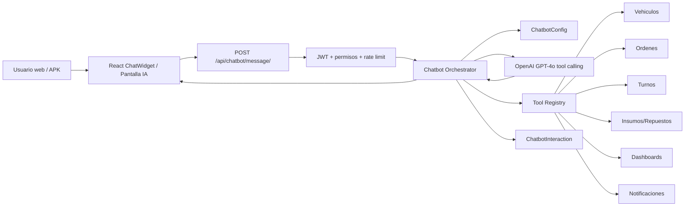

# 06 - Chatbot IA enterprise: arquitectura y diseno de tools

## 1. Alcance de la etapa

Esta etapa define la arquitectura del chatbot operativo para AutoFlow. No implementa todavia todo el backend ni el widget final; deja contratos, permisos, tools y riesgos listos para construir la Etapa 2 sin acoplar el modelo de IA directamente a los viewsets existentes.

Objetivo: pasar del chat basico a un asistente conversacional embebido que pueda consultar datos reales, proponer acciones y ejecutar cambios solo con confirmacion explicita del usuario.

## 2. Decisiones tecnicas

- Crear una app Django nueva: `apps.chatbot`.
- Endpoint principal: `POST /api/chatbot/message/`.
- Mantener JWT obligatorio para todo el chatbot.
- Usar OpenAI Chat Completions con tool calling y modelo configurable por entorno (`OPENAI_MODEL`, default `gpt-4o`).
- Separar las tools en servicios Python internos por dominio: vehiculos, turnos, ordenes, inventario, facturacion, dashboard y notificaciones.
- No llamar a los endpoints HTTP internos desde las tools. Las tools deben usar servicios/ORM/serializers para evitar latencia innecesaria y duplicacion de permisos.
- Registrar cada intercambio en `ChatbotInteraction`.
- Guardar configuracion activa en `ChatbotConfig`, editable solo por administrador.
- Exigir confirmacion para toda accion de escritura. El primer mensaje prepara la accion; el segundo, con confirmacion, ejecuta.
- El frontend web debe tener dos experiencias:
  - Pagina completa de App IA ya existente para configuracion/conversacion.
  - `ChatWidget` flotante global para uso operativo rapido.
- La APK debe consumir el mismo endpoint REST, sin logica distinta de negocio.

## 3. Arquitectura propuesta



## 4. Flujo conversacional

1. El usuario envia `message`, `session_id` y el historial visible.
2. Backend valida JWT, rol y rate limit.
3. Backend carga `ChatbotConfig` activa.
4. Backend arma system prompt con:
   - prompt fijo operativo,
   - reglas de seguridad,
   - tools habilitadas,
   - permisos del usuario,
   - contexto minimo del negocio.
5. OpenAI decide responder directamente o pedir una tool.
6. Si la tool es de lectura, se ejecuta y se envia el resultado al modelo para redactar respuesta final.
7. Si la tool es de escritura, el backend devuelve una solicitud de confirmacion y guarda `pending_action`.
8. Solo si el usuario confirma, se ejecuta la tool de escritura.
9. Se registra `ChatbotInteraction` con tools usadas, tokens y tiempo.

## 5. Contrato endpoint principal

### Request

```json
{
  "session_id": "web-1730000000-abc123",
  "message": "Cual es el estado del vehiculo ABC123?",
  "history": [
    { "role": "user", "content": "Hola" },
    { "role": "assistant", "content": "Hola, en que te ayudo?" }
  ],
  "pending_action": null
}
```

### Response de lectura

```json
{
  "session_id": "web-1730000000-abc123",
  "message": {
    "role": "assistant",
    "content": "El vehiculo ABC123 tiene una orden activa en reparacion con 60% de avance."
  },
  "rich_content": [
    {
      "type": "vehicle_card",
      "title": "ABC123 - Ford Focus",
      "status": "En reparacion",
      "items": [
        { "label": "Cliente", "value": "Juan Perez" },
        { "label": "OT", "value": "OT-2026-0003" }
      ]
    }
  ],
  "tools_used": ["get_vehicle_status"],
  "requires_confirmation": false
}
```

### Response con confirmacion requerida

```json
{
  "session_id": "web-1730000000-abc123",
  "message": {
    "role": "assistant",
    "content": "Voy a marcar la tarea Cambio de paragolpes como completada. Confirmas la accion?"
  },
  "pending_action": {
    "tool": "complete_task",
    "arguments": { "task_id": "uuid" },
    "summary": "Completar tarea Cambio de paragolpes"
  },
  "requires_confirmation": true
}
```

## 6. Modelos Django

### ChatbotInteraction

- `id`: UUID
- `user`: FK a usuario
- `session_id`: string indexado
- `role`: `user`, `assistant`, `system`, `tool`
- `content`: text
- `tools_used`: JSON
- `tokens_used`: integer nullable
- `response_time_ms`: integer nullable
- `metadata`: JSON opcional para modelo, errores, rich content
- `created_at`: datetime indexado

Indices:

- `(user, created_at)`
- `(session_id, created_at)`
- `(role, created_at)`

### ChatbotConfig

- `id`: UUID
- `model_name`: string, default `gpt-4o`
- `system_prompt`: text
- `max_tokens`: integer, default `900`
- `temperature`: decimal, default `0.2`
- `enabled_tools`: JSON array
- `is_active`: boolean
- `updated_by`: FK usuario
- `updated_at`: datetime

Regla: solo una configuracion activa por ambiente.

## 7. System prompt base

```text
Sos un asistente operativo de taller automotor. Ayudas al equipo a consultar y gestionar vehiculos, ordenes de trabajo, turnos, repuestos, materiales, facturacion e indicadores. Respondes siempre en espanol, de forma clara y directa. Antes de ejecutar cualquier accion que modifique datos, siempre pedis confirmacion al usuario. Si no tenes datos suficientes para responder, lo indicas claramente en lugar de inventar informacion. Cuando mostras listas, usas formato estructurado. Si el usuario parece confundido, ofreces acciones rapidas para guiarlo.
```

## 8. Politica de permisos por tool

| Tool | Tipo | Admin | Operativo | Administracion | App user |
| --- | --- | --- | --- | --- | --- |
| `get_vehicle_status` | lectura | si | si | si | si |
| `get_vehicle_history` | lectura | si | si | si | si |
| `get_active_work_orders` | lectura | si | si | si | si |
| `get_overdue_work_orders` | lectura | si | si | si | si |
| `get_work_order_tasks` | lectura | si | si | si | si |
| `get_appointments_summary` | lectura | si | si | si | si |
| `get_stock_alert` | lectura | si | si | si | si |
| `get_dashboard_summary` | lectura | si | si | si | si |
| `create_appointment` | escritura | si | si | no | si |
| `update_work_order_status` | escritura | si | si | no | limitado |
| `complete_task` | escritura | si | si | no | si |
| `send_appointment_notification` | escritura | si | si | no | si |
| `create_work_order_note` | escritura | si | si | no | si |
| `create_invoice_payment_link` | escritura | si | no | si | no |
| `mark_invoice_paid_manual` | escritura | si | no | si | no |

Regla transversal: eliminar, facturar, cerrar OT y modificar registros criticos quedan bloqueados para `app_user` y requieren administrador o administracion segun el modulo.

## 9. Tool schemas iniciales

### get_vehicle_status

```json
{
  "name": "get_vehicle_status",
  "description": "Consulta el estado operativo de un vehiculo por patente.",
  "parameters": {
    "type": "object",
    "properties": {
      "plate": { "type": "string", "description": "Patente o dominio del vehiculo" }
    },
    "required": ["plate"],
    "additionalProperties": false
  }
}
```

### get_active_work_orders

```json
{
  "name": "get_active_work_orders",
  "description": "Lista ordenes de trabajo activas con filtros opcionales.",
  "parameters": {
    "type": "object",
    "properties": {
      "status": { "type": "string" },
      "priority": { "type": "string" },
      "sector": { "type": "string" },
      "limit": { "type": "integer", "minimum": 1, "maximum": 20 }
    },
    "additionalProperties": false
  }
}
```

### get_overdue_work_orders

```json
{
  "name": "get_overdue_work_orders",
  "description": "Lista ordenes activas con fecha estimada vencida.",
  "parameters": {
    "type": "object",
    "properties": {
      "limit": { "type": "integer", "minimum": 1, "maximum": 20 }
    },
    "additionalProperties": false
  }
}
```

### get_work_order_tasks

```json
{
  "name": "get_work_order_tasks",
  "description": "Obtiene tareas de una orden de trabajo.",
  "parameters": {
    "type": "object",
    "properties": {
      "order_id": { "type": "string" },
      "order_number": { "type": "string" },
      "status": { "type": "string" }
    },
    "additionalProperties": false
  }
}
```

### create_appointment

```json
{
  "name": "create_appointment",
  "description": "Crea un turno para cliente y vehiculo. Requiere confirmacion previa.",
  "parameters": {
    "type": "object",
    "properties": {
      "client_id": { "type": "string" },
      "vehicle_id": { "type": "string" },
      "scheduled_at": { "type": "string", "format": "date-time" },
      "notes": { "type": "string" },
      "send_notification": { "type": "boolean" }
    },
    "required": ["client_id", "vehicle_id", "scheduled_at"],
    "additionalProperties": false
  }
}
```

### update_work_order_status

```json
{
  "name": "update_work_order_status",
  "description": "Actualiza estado de una orden. Requiere confirmacion previa.",
  "parameters": {
    "type": "object",
    "properties": {
      "order_id": { "type": "string" },
      "new_status": {
        "type": "string",
        "enum": ["scheduled", "received", "estimating", "approved", "waiting_parts", "in_repair", "in_paint", "finished", "delivered", "closed", "cancelled"]
      },
      "notes": { "type": "string" }
    },
    "required": ["order_id", "new_status"],
    "additionalProperties": false
  }
}
```

### complete_task

```json
{
  "name": "complete_task",
  "description": "Marca una tarea de OT como completada. Requiere confirmacion previa.",
  "parameters": {
    "type": "object",
    "properties": {
      "task_id": { "type": "string" },
      "notes": { "type": "string" }
    },
    "required": ["task_id"],
    "additionalProperties": false
  }
}
```

### get_stock_alert

```json
{
  "name": "get_stock_alert",
  "description": "Lista repuestos y materiales con stock critico.",
  "parameters": {
    "type": "object",
    "properties": {
      "kind": { "type": "string", "enum": ["all", "parts", "materials"] },
      "limit": { "type": "integer", "minimum": 1, "maximum": 50 }
    },
    "additionalProperties": false
  }
}
```

### send_appointment_notification

```json
{
  "name": "send_appointment_notification",
  "description": "Envia o reenvia notificacion de turno por email y/o WhatsApp. Requiere confirmacion previa.",
  "parameters": {
    "type": "object",
    "properties": {
      "appointment_id": { "type": "string" },
      "channels": {
        "type": "array",
        "items": { "type": "string", "enum": ["email", "whatsapp"] },
        "minItems": 1
      }
    },
    "required": ["appointment_id", "channels"],
    "additionalProperties": false
  }
}
```

### get_dashboard_summary

```json
{
  "name": "get_dashboard_summary",
  "description": "Obtiene resumen operativo y financiero segun permisos del usuario.",
  "parameters": {
    "type": "object",
    "properties": {
      "scope": { "type": "string", "enum": ["operational", "financial", "all"] }
    },
    "additionalProperties": false
  }
}
```

## 10. Respuestas enriquecidas soportadas

El backend puede devolver `rich_content` para que React y APK rendericen sin parsear texto libre:

- `vehicle_card`
- `work_order_card`
- `task_list`
- `appointment_card`
- `stock_table`
- `dashboard_metrics`
- `confirmation`
- `error`

Ejemplo:

```json
{
  "type": "stock_table",
  "title": "Stock critico",
  "columns": ["Codigo", "Nombre", "Stock", "Minimo"],
  "rows": [
    ["REP-001", "Filtro de aceite", "2", "5"]
  ]
}
```

## 11. Seguridad

- JWT obligatorio.
- Tools filtradas por rol antes de enviar schemas al modelo.
- Validacion de permisos nuevamente antes de ejecutar cada tool.
- Confirmacion obligatoria para escrituras.
- Nunca permitir que el modelo construya SQL.
- Limitar cantidad de resultados por tool.
- Sanitizar entradas: patente, IDs, fechas, estados.
- No devolver secretos, tokens, configuraciones SMTP, MercadoPago ni OpenAI.
- Guardar auditoria funcional y registro de interaccion IA.
- Rate limit sugerido:
  - Admin: 60 mensajes cada 10 minutos.
  - Operativo/administracion/app_user: 30 mensajes cada 10 minutos.

## 12. Riesgos y mitigaciones

- Riesgo: el modelo intenta ejecutar acciones sin confirmacion.
  - Mitigacion: el backend bloquea toda tool de escritura si `confirmed` no es verdadero.
- Riesgo: datos inventados.
  - Mitigacion: prompt + tools de lectura + respuestas con fuentes internas.
- Riesgo: fuga de datos entre roles.
  - Mitigacion: tools filtradas por rol y queryset con permisos.
- Riesgo: costo alto de tokens.
  - Mitigacion: historial resumido, `max_tokens`, truncado y configuracion por admin.
- Riesgo: dependencia externa de OpenAI.
  - Mitigacion: mensaje de degradacion y registro de error si la API falla.
- Riesgo: acciones duplicadas al reenviar confirmacion.
  - Mitigacion: `pending_action_id` idempotente con expiracion.

## 13. Mejoras recomendadas

- Agregar `ChatbotPendingAction` si se necesita persistir confirmaciones entre sesiones o APK.
- Agregar resumen automatico de conversacion cuando el historial crece.
- Permitir prompts por rol o sector.
- Crear pantalla admin para habilitar/deshabilitar tools.
- Agregar telemetria de costo por usuario.
- Agregar pruebas unitarias por tool y pruebas de permisos por rol.

## 14. Entregables de la Etapa 2

- App Django `apps.chatbot`.
- Modelos `ChatbotInteraction` y `ChatbotConfig`.
- Migraciones.
- Endpoint `POST /api/chatbot/message/`.
- Servicio `OpenAIChatbotClient`.
- `ToolRegistry` con schemas filtrados por rol.
- Primera tanda de tools reales:
  - `get_vehicle_status`
  - `get_overdue_work_orders`
  - `get_work_order_tasks`
  - `get_stock_alert`
  - `get_dashboard_summary`
- Registro de interacciones y errores.
- Tests basicos de permisos y endpoint.
